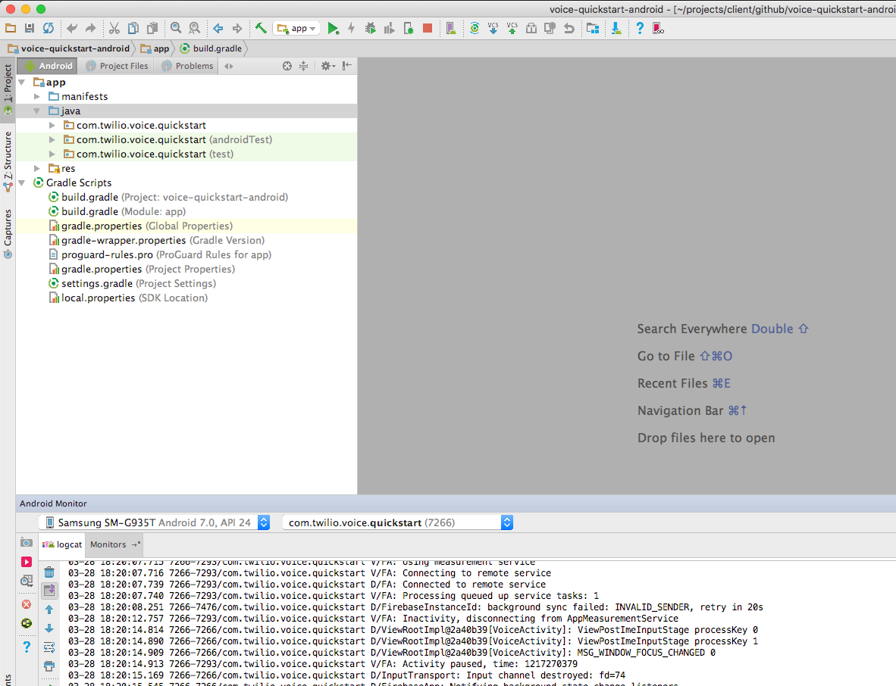
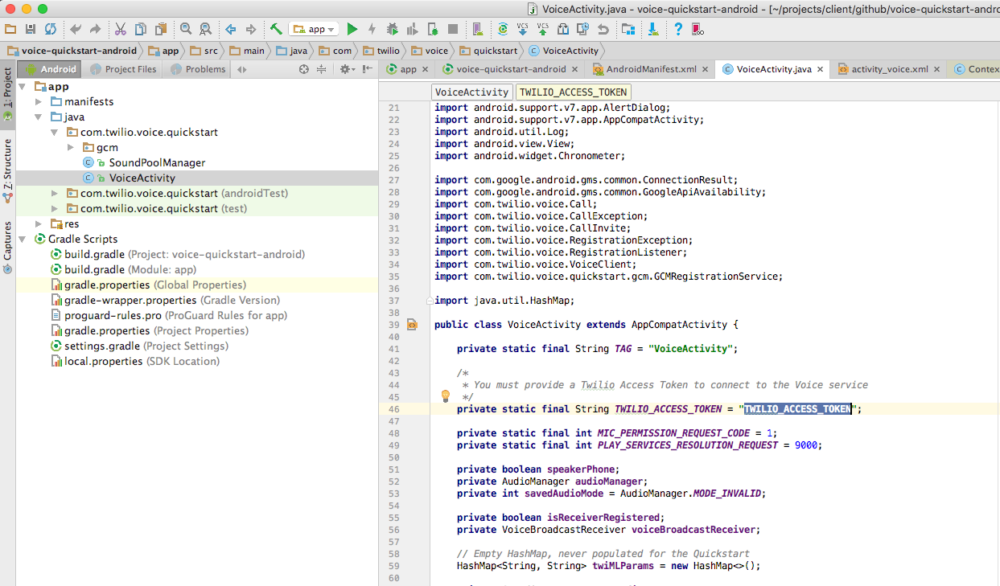

# Twilio Voice Quickstart for Android

Get started with Voice on Android:

- [Quickstart](#quickstart) - Run the quickstart app
- [Emulator Support](#emulator-support) - Android emulator support
- [Reducing APK Size](#reducing-apk-size) - Use ABI splits to reduce APK size
- [More Documentation](#more-documentation) - More documentation related to the Voice Android SDK
- [Twilio Helper Libraries](#twilio-helper-libraries) - TwiML quickstarts.
- [Issues & Support](#issues-and-support) - Filing issues and general support

## Quickstart

To get started with the Quickstart application follow these steps. Steps 1-6 will allow you to make a call. The remaining steps 7-8 will enable push notifications using FCM.

1. [Open this project in Android Studio](#bullet1)
2. [Create a Voice API key](#bullet2)
3. [Configure a server to generate an access token to use in the app](#bullet3)
4. [Create a TwiML application](#bullet4)
5. [Configure your application server](#bullet5)
6. [Run the app](#bullet6)
7. [Generate google-services.json](#bullet7)
8. [Add a Push Credential using your FCM Server API Key](#bullet8)
9. [Receiving an Incoming Notification](#bullet9)

### 1. Open the project in Android Studio

### 2. Create a Voice API key

Go to the [API Keys page](https://www.twilio.com/console/voice/runtime/api-keys) and create a new API key.

Save the generated `API_KEY` and `API_KEY_SECRET` in your notepad. You will need them in the next step.

### 3. Configure a server to generate an access token to use in the app

[Download starter project for the server.](https://github.com/twilio/voice-quickstart-server-python)
Follow the instructions in the server's README to get the application server up and running locally and accessible via the public Internet. For now just add the Twilio Account SID that you can obtain from the console, and  the `API_KEY` and `API_SECRET` you obtained in the previous step. 

    ACCOUNT_SID = 'AC***'
    API_KEY = 'SK***'
    API_KEY_SECRET = '***'

### 4. Create a TwiML application

Next, we need to create a TwiML application. A TwiML application identifies a public URL for retrieving TwiML call control instructions. When your Android app makes a call to the Twilio cloud, Twilio will make a webhook request to this URL, your application server will respond with generated TwiML, and Twilio will execute the instructions you’ve provided.

To create a TwiML application, go to the TwiML app page. Create a new TwiML application, and use the public URL of your application server’s `/outgoing` endpoint as the Voice Request URL.

As you can see we’ve used our ngrok public address in the Request URL field above.

Save your TwiML Application configuration, and grab the TwiML Application SID (a long identifier beginning with the characters "AP").

### 5. Configure your application server

Put the remaining `APP_SID` configuration info into your application server by opening `server.py` and setting the following constants with the information you gathered above.

    ACCOUNT_SID = 'AC***'
    API_KEY = 'SK***'
    API_KEY_SECRET = '***'
    APP_SID = 'AP***'

Once you’ve done that, restart the server so it uses the new configuration info. Now it's time to test.

Open up a browser and visit the URL for your application server's Access Token endpoint: `https://{YOUR-SERVER}/accessToken`. If everything is configured correctly, you should see a long string of letters and numbers, which is a Twilio Access Token. Your Android app will use a token like this to connect to Twilio.

### 6. Run the app

Paste the Access Token into the VoiceActivity.java. 

Run the quickstart app on an Android device

"

Press the call button to connect to Twilio

### 7. Generate `google-services.json`

The Programmable Voice Android SDK uses Firebase Cloud Messaging push notifications to let your application know when it is receiving an incoming call. If you want your users to receive incoming calls, you’ll need to enable FCM in your application.

Follow the steps under **Use the Firebase Assistant** in the [Firebase Developers Guide](https://firebase.google.com/docs/android/setup). Once you connect and sync to Firebase successfully, you will be able to download the `google-services.json` for your application. 

Login to Firebase console and make a note of generated `Server API Key` and `Sender ID` in your notepad. You will need them in the next step.

"

Make sure the generated `google-services.json` is downloaded to the `app` directory of the quickstart project to replace the existing `app/google-services.json` stub json file. If you are using the Firebase plugin make sure to remove the stub `google-services.json` file first.

As a final step re-run the application from Android Studio to ensure the APK now has the latest `google-services.json` file.

### 8. Add a Push Credential using your FCM `Server API Key` 

You will need to store the FCM `Server API Key` with Twilio so that we can send push notifications to your app on your behalf. Once you store the API Key with Twilio, it will get assigned a Push Credential SID so that you can later specify which key we should use to send push notifications.

Go to the [Push Credentials page](https://www.twilio.com/console/voice/credentials) and create a new Push Credential.

Paste in the `Server API Key` and press Save.

"

### 9. Receiving an Incoming Notification

Put the `PUSH_CREDENTIAL_SID` configuration info into your application server by opening `server.py` and setting the following constants with the information you gathered above.

    ACCOUNT_SID = 'AC***'
    API_KEY = 'SK***'
    API_KEY_SECRET = '***'
    PUSH_CREDENTIAL_SID = 'CR***'
    APP_SID = 'AP***'

Once you’ve done that, restart the server so it uses the new configuration info. Now it's time to test. Hit your application server's `placeCall` endpoint. This will trigger a Twilio REST API request that will make an inbound call to your mobile app. Once your app accepts the call, you should hear a congratulatory message.

"

## Emulator Support

The SDK supports using emulators except in the following known cases:

1. Emulators with API 22 or lower have bad audio emulation, the sound is generally inaudible
2. Emulators must have Google Play services support to use FCM to receive call invites
3. Running on x86 API 25 emulators results in application crashes

In general we advise using a real device when doing development with our SDK since real-time audio is a performance oriented operation.

## Reducing APK Size

Our library is built using native libraries. As a result, if you use the default gradle build you will generate an APK with all four architectures(armeabi-v7a, arm64-v8a, x86, x86_64) in your APK.

[APK splits](https://developer.android.com/studio/build/configure-apk-splits.html) allow developers to build multiple APKs for different screen sizes and ABIs. Enabling APK splits ensures that the minimum amount of files required to support a particular device are packaged into an APK.

The following snippet shows an example `build.gradle` with APK splits enabled.

    apply plugin: 'com.android.application'

    android {
        // Specify that we want to split up the APK based on ABI
        splits {
            abi {
                // Enable ABI split
                enable true

                // Clear list of ABIs
                reset()

                // Specify each architecture currently supported by the Voice SDK
                include "armeabi-v7a", "arm64-v8a", "x86", "x86_64"

                // Specify that we do not want an additional universal SDK
                universalApk false
            }
        }
    }

The adoption of APK splits requires developers to submit multiple APKs to the Play Store. Refer to [Google’s documentation](https://developer.android.com/google/play/publishing/multiple-apks.html)  for how to support this in your application.

## More Documentation

You can find more documentation on getting started as well as our latest Javadoc below:

* [Getting Started](https://www.twilio.com/docs/api/voice-sdk/android/getting-started)
* [Javadoc](https://media.twiliocdn.com/sdk/android/voice/latest/docs/)

## Twilio Helper Libraries

To learn more about how to use TwiML and the Programmable Voice Calls API, check out our TwiML quickstarts:

* [TwiML Quickstart for Python](https://www.twilio.com/docs/quickstart/python/twiml)
* [TwiML Quickstart for Ruby](https://www.twilio.com/docs/quickstart/ruby/twiml)
* [TwiML Quickstart for PHP](https://www.twilio.com/docs/quickstart/php/twiml)
* [TwiML Quickstart for Java](https://www.twilio.com/docs/quickstart/java/twiml)
* [TwiML Quickstart for C#](https://www.twilio.com/docs/quickstart/csharp/twiml)

## Issues and Support

Please file any issues you find here on Github.
For general inquiries related to the Voice SDK you can file a support ticket.

## License
MIT
