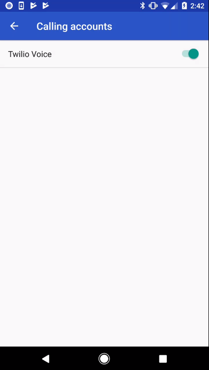
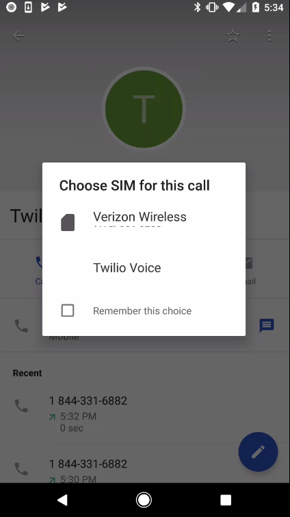

# Custom ConnectionService using Voice Android SDK

Get started with Voice on Android by following steps in [Quickstart](../README.md).

## Examples

Once you are up and running with basic quickstart application, it's very easy to get integrated with `ConnectionService`. You need to make sure custom calling accounts are enabled on your device.

### Make A Call

You can initiate a call from the `native Phone Application` or from the `exampleConnectionService` application. 

#### Make Twilio Voice SDK Calls using the `native Phone Application`

Run the application. This will register the `Twilio Voice` as one of the custom calling accounts. Enable `Twilio Voice`. 

Make a call using the native phone dialer. It will prompt you to select the calling account. Choose `Twilio Voice`.

#### Make Calls using `exampleconnectionservice`

##### Make client to client call
To make a call to a client, you need the https://github.com/twilio/voice-quickstart-android/tree/master/appapplication running on another device. Make sure you use a different identity in your access token when registering the new device. 

Open the `exampleconnectionservice` app. Press the call button to open the call dialog. Enter the client identity of the newly registered device to initiate a client to client call.

`bob` receives the call.

##### Make client to PSTN call

Open the `exampleconnectionservice` app. Press the call button to open the call dialog. Enter a PSTN number and press the call button to place a call.

